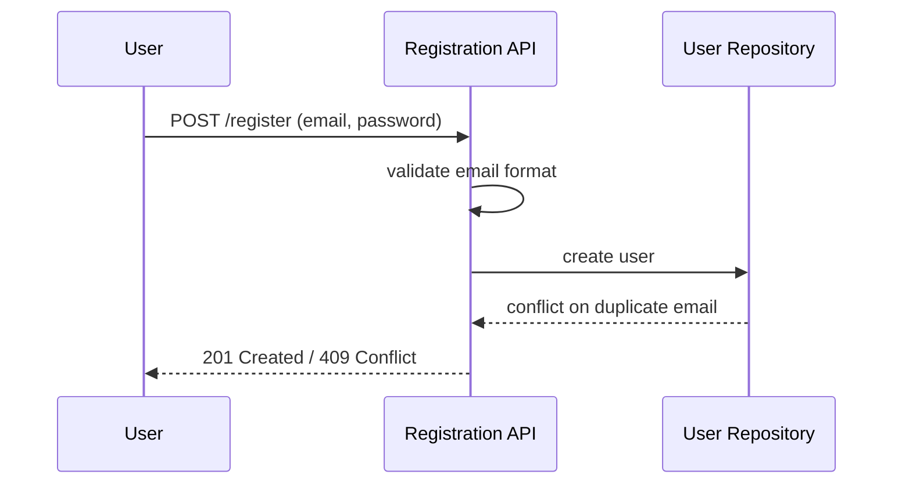

# Design

## Architecture

The authentication module consists of a registration service, a validation library, and a user repository. The registration service orchestrates validation before persistence; the repository enforces the unique email constraint at the storage layer.

## Sequence Diagram

## Testing Strategy

- Unit tests for email format and password validation rules
- Integration tests for the registration endpoint, including duplicate email conflicts
